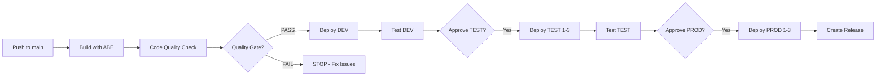

# webMethods CI/CD Pipeline with Custom Framework

Production-ready CI/CD pipeline for webMethods Integration Server deployments using a **custom-built, self-contained framework**. No external dependencies required.

## 🏗️ Architecture

### Environments
- **DEV**: 1 server (dev-server.company.com:5555)
- **TEST**: 3 servers (test1/test2/test3-server.company.com:5555)
- **PROD**: 3 servers (prod1/prod2/prod3-server.company.com:5555)
- **Deployer**: deployer.company.com:5555

### Components
- Integration Server
- Universal Messaging
- JDBC Adapter
- AS400 Adapter

## 📁 Project Structure

```
hsi_onprem_cicd/
├── .github/
│   └── workflows/
│       ├── webmethods-cicd.yml      # Main CI/CD pipeline
│       ├── sonarqube.yml             # Code quality analysis
│       └── rollback.yml              # Rollback workflow
├── cicd/                             # Custom CI/CD Framework
│   ├── build.xml                    # Main orchestrator
│   ├── build-abe.xml                # ABE integration
│   ├── build-deployer.xml           # Deployment automation
│   ├── build-test.xml               # Test execution
│   └── scripts/
│       └── GenerateProjectAutomator.groovy
├── packages/                         # Integration Server packages
│   └── MyBusinessPackage/
│       ├── manifest.v3
│       └── ns/
├── tests/                            # WmTestSuite tests
│   └── MyBusinessPackageTest/
│       └── setup/
│           └── test_service.xml
├── varsub/                           # Variable substitution
│   ├── DEV/
│   ├── TEST/
│   └── PROD/
├── deployer/                         # Deployer configuration
│   ├── ProjectAutomator.template.xml
│   └── environments/
│       ├── DEV.properties
│       ├── TEST.properties
│       └── PROD.properties
├── ENV.groovy                        # Environment definitions
├── build.properties                  # Build configuration
├── sonar-project.properties          # SonarQube configuration
├── FRAMEWORK_DOCUMENTATION.md        # Detailed framework docs
├── SONARQUBE_SETUP.md               # SonarQube setup guide
└── README.md
```

## 🚀 Quick Start

### Prerequisites

1. **webMethods Installation**
   - Integration Server 10.x or 11.x
   - Deployer
   - Asset Build Environment (ABE)

2. **GitHub Repository**
   - Admin access to configure secrets and environments
   - Self-hosted runner with webMethods access

3. **Network Access**
   - Build server can reach all target servers
   - Deployer can reach all Integration Servers

### Step 1: Clone the Repository

```bash
git clone https://github.com/YOUR_ORG/hsi_onprem_cicd.git
cd hsi_onprem_cicd
```

**Note**: This framework is completely self-contained. No external dependencies or libraries need to be downloaded.

### Step 2: Configure GitHub Secrets

Navigate to **Settings → Secrets and variables → Actions → New repository secret**

Add the following secrets:

**Deployment Secrets:**
```
DEPLOYER_HOST=deployer.company.com
DEPLOYER_PORT=5555
DEPLOYER_USERNAME=Administrator
DEPLOYER_PASSWORD=manage
```

**SonarQube Secrets (Required for code quality gating):**
```
SONAR_TOKEN=your_sonarqube_token
SONAR_HOST_URL=http://sonarqube.company.com:9000
```

**⚠️ Important**: SonarQube is integrated as a mandatory quality gate before DEV deployment. The pipeline will block deployment if quality gate fails. See [SONARQUBE_SETUP.md](SONARQUBE_SETUP.md) for detailed configuration.

### Step 3: Setup Self-Hosted Runner

On your build server:

```bash
# Create runner directory
mkdir -p /opt/actions-runner && cd /opt/actions-runner

# Download runner (check latest version at https://github.com/actions/runner/releases)
curl -o actions-runner-linux-x64-2.311.0.tar.gz -L \
  https://github.com/actions/runner/releases/download/v2.311.0/actions-runner-linux-x64-2.311.0.tar.gz

# Extract
tar xzf ./actions-runner-linux-x64-2.311.0.tar.gz

# Configure
./config.sh \
  --url https://github.com/YOUR_ORG/hsi_onprem_cicd \
  --token YOUR_REGISTRATION_TOKEN \
  --name webmethods-build-server \
  --labels webmethods-build,self-hosted,linux

# Install as service
sudo ./svc.sh install
sudo ./svc.sh start

# Verify
sudo ./svc.sh status
```

### Step 4: Configure Environment Protection Rules

#### DEV Environment
- **Settings → Environments → New environment → "DEV"**
- No protection rules (auto-deploy)

#### TEST Environment
- **Settings → Environments → New environment → "TEST"**
- ✅ Required reviewers: 1 person
- ⏱️ Wait timer: 0 minutes
- Deployment branches: `main` only

#### PROD Environment
- **Settings → Environments → New environment → "PROD"**
- ✅ Required reviewers: 2 people
- ⏱️ Wait timer: 30 minutes
- Deployment branches: `main` only

### Step 5: Configure Branch Protection

**Settings → Branches → Add rule for `main`**:
- ✅ Require pull request reviews (1 approval)
- ✅ Require status checks to pass before merging
  - Select: `build`, `code-quality`, `test-dev`
- ✅ Require branches to be up to date before merging
- ✅ Include administrators

### Step 6: Verify Framework Installation

```bash
# Verify custom framework files exist
ls -la cicd/
# Should show: build.xml, build-abe.xml, build-deployer.xml, build-test.xml

# Test ANT build locally (optional)
cd cicd
ant -f build.xml init
```

## 🔄 CI/CD Workflow

### Automatic Deployment Flow



**Framework**: All build, deployment, and test operations use the custom `cicd/` framework.

### Pipeline Stages

1. **Build** (Automatic)
   - Checkout code
   - Build with Asset Build Environment (ABE)
   - Create File-Based Repository (FBR)
   - Archive build artifacts

2. **Code Quality** (Automatic - Quality Gate)
   - Run SonarQube analysis
   - Check quality gate status
   - **BLOCKS deployment if quality gate fails**
   - Add PR comments with results
   - Upload analysis reports

3. **Deploy to DEV** (Automatic - Only if quality gate passes)
   - Download build artifacts
   - Generate Project Automator XML (Groovy script)
   - Execute deployment via `cicd/build-deployer.xml`
   - Apply variable substitution from `varsub/DEV/`

4. **Test on DEV** (Automatic)
   - Execute `cicd/build-test.xml`
   - Run WmTestSuite tests
   - Generate JUnit XML reports
   - Publish results to GitHub Actions

5. **Deploy to TEST** (Manual approval required - 1 reviewer)
   - Sequential deployment to 3 servers
   - Apply TEST-specific variables

6. **Test on TEST** (Automatic)
   - Run integration tests
   - Validate deployment

7. **Deploy to PROD** (Manual approval required - 2 reviewers)
   - Sequential deployment to 3 servers
   - 2-minute wait between servers
   - Apply PROD-specific variables

8. **Create Release** (Automatic)
   - Tag release
   - Generate release notes

## 📝 Usage

### Trigger Automatic Deployment

```bash
# Make changes to packages
git add packages/MyBusinessPackage/
git commit -m "feat: add new service"
git push origin main
```

This will automatically:
1. Build the package
2. Deploy to DEV
3. Run tests on DEV
4. Wait for TEST approval
5. Wait for PROD approval

### Manual Deployment

Go to **Actions → webMethods Multi-Server CI/CD Pipeline → Run workflow**

Select:
- Branch: `main`
- Environment: `DEV`, `TEST`, or `PROD`
- Skip tests: `false` (default)

### Rollback

Go to **Actions → Rollback Deployment → Run workflow**

Enter:
- Environment: `TEST` or `PROD`
- Build number: Previous successful build number

## 🔧 Configuration

### Update Environment Variables

Edit `ENV.groovy` to modify server configurations:

```groovy
environments {
    DEV {
        IntegrationServers {
            IS_DEV {
                host = 'dev-server.company.com'
                port = '5555'
                // ...
            }
        }
    }
}
```

### Update Variable Substitution

Edit files in `varsub/` directory:

```properties
# varsub/DEV/MyBusinessPackage.vs.properties
database.url=jdbc:oracle:thin:@dev-db.company.com:1521:DEVDB
database.username=dev_user
```

### Modify Build Properties

Edit `build.properties`:

```properties
bda.projectName=hsi_onprem_cicd
config.deployer.doVarSub=true
config.test.failBuildOnTestError=true
```

## 📦 Adding New Packages

1. Create package directory:
```bash
mkdir -p packages/MyNewPackage/ns/mycompany/services
```

2. Add manifest.v3:
```xml
<?xml version="1.0" encoding="UTF-8"?>
<Values version="2.0">
  <value name="enabled">yes</value>
  <value name="system_package">no</value>
  <value name="version">1.0</value>
</Values>
```

3. Add variable substitution:
```bash
cp varsub/DEV/MyBusinessPackage.vs.properties \
   varsub/DEV/MyNewPackage.vs.properties
```

4. Commit and push:
```bash
git add packages/MyNewPackage varsub/
git commit -m "feat: add MyNewPackage"
git push origin main
```

## 🧪 Adding Tests

1. Create test package:
```bash
mkdir -p tests/MyNewPackageTest/setup
```

2. Add test XML:
```xml
<!-- tests/MyNewPackageTest/setup/test_myservice.xml -->
<?xml version="1.0" encoding="UTF-8"?>
<TestSuite>
  <TestCase name="test_myservice">
    <!-- Test definition -->
  </TestCase>
</TestSuite>
```

3. Commit and push:
```bash
git add tests/MyNewPackageTest
git commit -m "test: add tests for MyNewPackage"
git push origin main
```

## 📊 Monitoring

### View Pipeline Status

- **Actions tab**: See all workflow runs
- **Environments**: View deployment history per environment
- **Releases**: See production releases

### Test Reports

- Automatically published after each test run
- Available in workflow summary
- JUnit XML format in `report/` directory

### Build Artifacts

- Retained for 30 days
- Download from workflow run page
- Contains FBR and build outputs

## 🔐 Security Best Practices

1. **Never commit credentials**
   - Use GitHub Secrets for all passwords
   - Use environment-specific secrets

2. **Protect production**
   - Require multiple approvals for PROD
   - Use wait timers
   - Restrict to main branch only

3. **Audit trail**
   - All deployments logged in GitHub
   - Approval history maintained
   - Release tags for tracking

4. **Access control**
   - Limit who can approve deployments
   - Use branch protection rules
   - Enable required reviews

## 🐛 Troubleshooting

### Build Fails

```bash
# Check ABE installation
ls -la $SAG_HOME/common/AssetBuildEnvironment

# Verify build properties
cat build.properties

# Test build locally
cd cicd
ant -f build.xml build -Dproject.properties=../build.properties -verbose

# Check runner logs
sudo journalctl -u actions.runner.* -f
```

### Deployment Fails

```bash
# Check Deployer logs
tail -f $SAG_HOME/IntegrationServer/instances/default/packages/WmDeployer/logs/CLI.log

# Verify connectivity
telnet deployer.company.com 5555

# Check generated Project Automator XML
cat deployer/Deployment_ProjectAutomator.xml

# Test deployment locally
cd cicd
ant -f build.xml deploy -Dproject.properties=../deploy.properties -verbose
```

### Tests Fail

```bash
# Check test reports
cat report/TEST-*.xml

# Verify test server connectivity
curl -u Administrator:manage http://dev-server.company.com:5555

# Run tests locally
cd cicd
ant -f build.xml test -Dproject.properties=../test.properties -verbose
```

### Framework Issues

```bash
# Verify all framework files exist
ls -la cicd/

# Check Groovy script syntax
groovy -c cicd/scripts/GenerateProjectAutomator.groovy

# Validate ENV.groovy
groovy -c ENV.groovy

# Test ANT targets
cd cicd
ant -f build.xml -projecthelp
```

## 📚 Documentation

### Framework Documentation
- **[FRAMEWORK_DOCUMENTATION.md](FRAMEWORK_DOCUMENTATION.md)** - Complete framework reference
- **[SETUP_GUIDE.md](SETUP_GUIDE.md)** - Detailed setup instructions

### External Resources
- [webMethods Deployer Documentation](https://www.ibm.com/docs/en/webmethods-integration/webmethods-deployer/11.1.0)
- [GitHub Actions Documentation](https://docs.github.com/en/actions)
- [Apache ANT Manual](https://ant.apache.org/manual/)
- [Groovy Documentation](https://groovy-lang.org/documentation.html)

### Framework Components
- `cicd/build.xml` - Main orchestrator
- `cicd/build-abe.xml` - Asset Build Environment integration
- `cicd/build-deployer.xml` - Deployment automation
- `cicd/build-test.xml` - Test execution framework
- `cicd/scripts/GenerateProjectAutomator.groovy` - Dynamic PA generator

## 🤝 Contributing

1. Create a feature branch
2. Make your changes
3. Submit a pull request
4. Wait for review and approval

## 📄 License

Copyright © 2024 Your Company. All rights reserved.

## 📞 Support

For issues or questions:
- Create an issue in this repository
- Contact: devops-team@company.com
- Slack: #webmethods-cicd

## 🎯 Key Features

✅ **Self-Contained Framework** - No external dependencies (Java + ANT only)
✅ **No Groovy Required** - Uses static XML templates with ANT property replacement
✅ **Multi-Server Deployment** - Sequential deployment to 3 TEST and 3 PROD servers
✅ **Environment-Specific Configuration** - Variable substitution per environment
✅ **Automated Testing** - WmTestSuite integration with JUnit reports
✅ **Manual Approvals** - Required for TEST and PROD deployments
✅ **Rollback Support** - One-click rollback to previous versions
✅ **Audit Trail** - Complete deployment history in GitHub
✅ **Production-Ready** - Battle-tested deployment patterns

---

**Last Updated**: 2026-04-09
**Version**: 2.0.0
**Framework**: Custom Build (Template-Based, No Groovy)
**Dependencies**: Java + ANT only